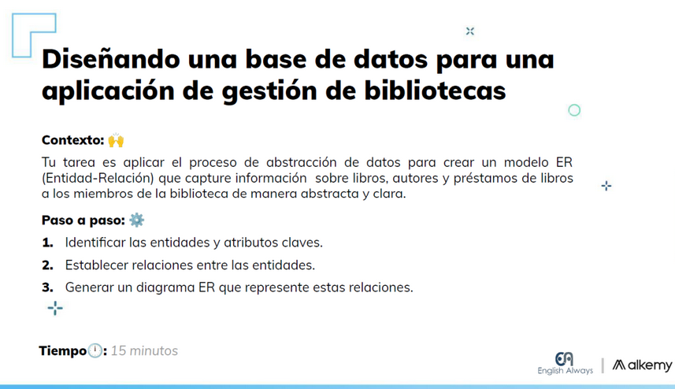
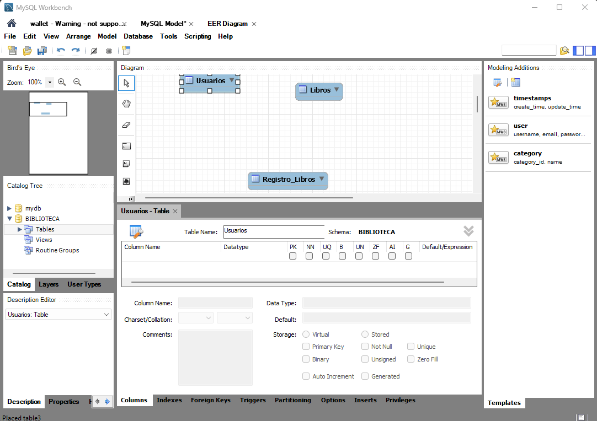
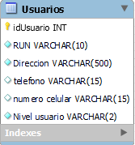
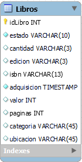
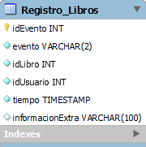
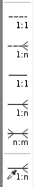
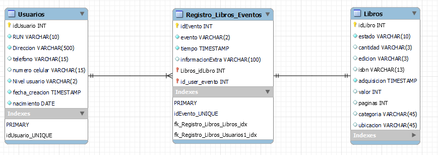
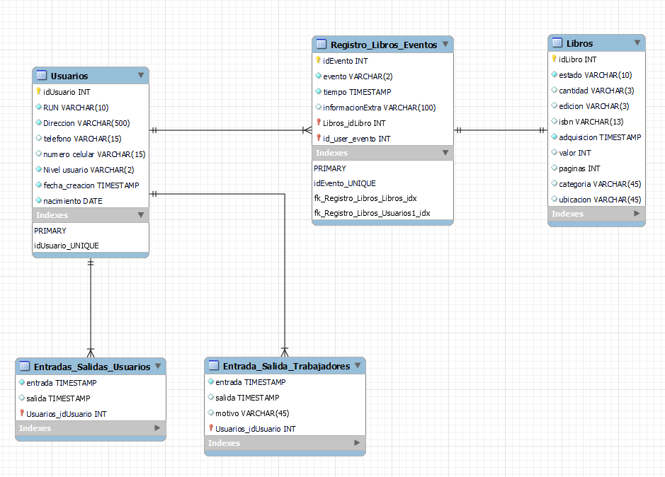
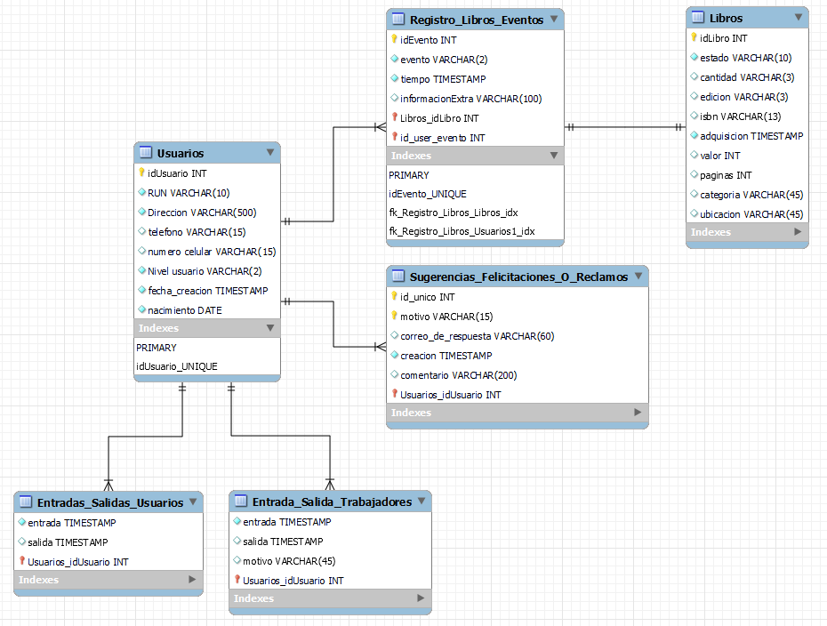

# DISEÑANDO UNA BASE DE DATOS PARA UNA APLICACION DE GESTION DE BIBLIOTECAS



Para realizar esto empezare abriendo ejecutando mi servidor en docker de mysql y abriendo MySQL Workbench y creare un archivo para crear los scripts.

<video controls src="20240414-1511-36.0812541.mp4" title="Title"></video>

Despues de esto creare una base de datos llamada BIBLIOTECA con el siguiente comandos, en la tercela linea le dire a workbench que la use.

```MySQL
-- CREANDO BASE DE DATOS BIBLIOTECA
CREATE DATABASE IF NOT EXISTS BIBLIOTECA;
USE BIBLIOTECA;
```

<video controls src="20240414-1515-25.8117486.mp4" title="Title"></video>

## ENTIDADES

Ahora el punto importante de esto es poder acceder al diagrama ER de esta base de datos para crear las entidades (informalmente conocidad como tablas) necesarias y sus relaciones.

<video controls src="20240414-1517-22.4026042.mp4" title="Title"></video>

Por ahora creare solo 3 entidades, si es necesario creare mas, para eso solo se debe dar click a icono en el siguiente video y despues dar click en el area de trabajo, repetir esto por cada entidad que necesites.

<video controls src="20240414-1521-43.8503530.mp4" title="Title"></video>

Deberiamos definir algunos nombres por el momento para estas entidades, se me ocurren los siguientes:

- Usuarios (podria contener a personas que usan el servicio y trabajadores de la biblioteca)
- Libros
- Registro_Libro (guardara acontecimientos como prestar libros, fecha en que se presto, fecha de entrega, quien realiza la accion, observacion de estado del libro)

Deben dar doble click en el titulo de la entidad y rellenar el formulario con la informacion que quieren cambiar



## COLUMNAS

### Usuarios
En esta entidad deberiamos tener un identificador unico para cada usuario, sus datos personales y de contacto, ademas de que autorizacion tiene(trabajador, usuarios, administrador, etc).

Por ahora mantendre esta configuracion:



### Libros

Considerare poner informacion de quien es el dueño del libro(existen veces que un libro puede estar prestado a la biblioteca por motivo de su rareza), si es que esta habilitado para ser prestado a los usuarios o se encuentra en un estado de restauracion, indicare la cantidad de ejemplares y a que edicion pertenecen, codigo isbn, fecha en que fue adquirido, costo del libro, cantidad de paginas, categoria literaria, ubicacion en la biblioteca para ser facilmente encontrado.



### REGISTRO_LIBROS

Para distinguir cada evento creare una llave unica llamada evento, esta entidad sera de tipo debil, sus datos podran ser modificados constantemente, ya que las entradas y salidas de prestamos suceden constantemente en una biblioteca, pondre algunos campos extras como el id del libro vinculado a la entidad Libros, otra como id usuario vinculada a la entidad Usuarios y algunos datos extra de tiempo y el numero que identifica al ejemplar en caso que sean mas de 1 en la misma edicion.



ahora otro punto que se debe realizar es vincular las entidades para que los registros tengan sentido. esto sera realizado con la herramientas al lado izquierdo



despues de algunas modificaciones menores, la base de datos queda asi



para mejorar la base de datos, podriamos agregar una entidad de horarios de entrada y salida, mucha gente va a entrar y salir, tenemos tambien a los trabajadores, por lo cual deberia tener dos entidades separadas para uso administrativo y otra solo para uso de registro en caso que los usarios lectores paguen alguna membresia o bien, se quiera saber quienes estaban en la biblioteca durante algun dia y horario especifico

asi quedaria


a veces los usuarios quieren mandar felicitaciones, comentarios o reclamos, por lo cual crearemos una entidad para que puedan hacerlo

finalmente el modelo quedaria de esta forma



> [!NOTE]
> La ubicacion del archivo del modelo se encuentra en este [link](modelo%20biblioteca.mwb)
> , cuenta con comentarios y ajustes en cada columna para que pueda funcionar, este archivo se debe abrir con MySQL Workbench