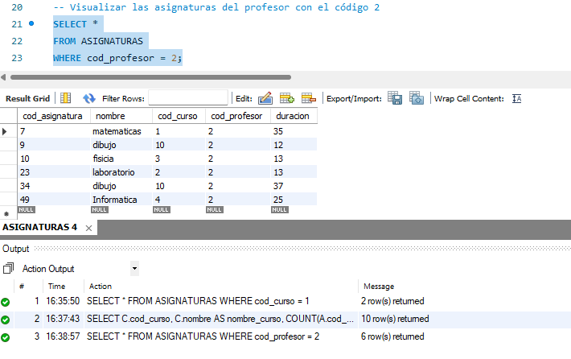
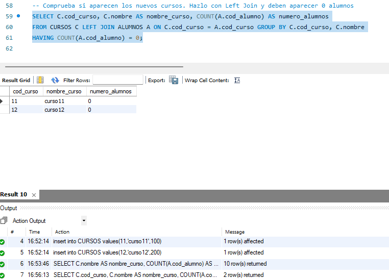

# JOIN – Uniones entre tablas

❖ Accedemos con mysql, mysql workbench o cualquier otra de las herramientas
con la que estés trabajando.
❖ Ejecuta el archivo “academia.sql”. Esto permite crear una base de datos
Academia con la siguiente estructura.


## Reparacion

Se nos entrego un script llamado [academia.sql](academia.sql) el cual contaba con varios errores, lo primero que toco hacer fue solucionarlos, cambiar nombres en minuscula por mayusculas de las entidades y en lineas donde se hacia referencia a estas, ademas, el nombre de ACADEMIA era llamado para ser llamado en mayusculas o en minusculas, algunos datos como apellidos estaban en forma null por lo que toco repararlos antes de popularlos. El resultado final de la reparacion esta en este link: [academia.sql](academia.sql).


**PRÁCTICAS MYSQLS**

JOIN – Uniones entre tablas

❖ Accedemos con mysql, mysql workbench o cualquier otra de las herramientas
con la que estés trabajando.

❖ Ejecuta el archivo “academia.sql”. Esto permite crear una base de datos
Academia con la siguiente estructura.


```
CURSOS: Datos de los cursos

  • Clave primaria: cod_curso
 
ALUMNOS : Datos de los alumnos

  • Clave primaria: cod_alumno

  • Clave foránea: cod_curso que apunta a la tabla Cursos

ASIGNATURAS : Datos de las asignaturas de cada curso

  • Clave primaria: cod_asignatura

  • Clave foránea: cod_curso que apunta a la tabla Cursos

  • Clave foránea: cod_profesor que apunta a la tabla Profesores

PROFESORES : Datos de los profesores con los cursos que imparte

  • Clave primaria: cod_profesor

NOTAS_ALUMNOS : Datos de los profesores con los cursos que imparte

  • Clave primaria: cod_alumno + cod_curso + cod_asignatura

  • Tiene los datos del alumno con la asignatura y el curso
  ```

  
❖ Seleccionar el nombre del alumno número 10 y el curso que está haciendo

```MySQL
SELECT A.nombre AS nombre_alumno, C.nombre AS nombre_curso
FROM ALUMNOS A
INNER JOIN CURSOS C ON A.cod_curso = C.cod_curso
WHERE A.cod_alumno = 10;
```


❖ Visualizar las asignaturas del curso 1.

```MySQL
SELECT *
FROM ASIGNATURAS
WHERE cod_curso = 1;
```


❖ Visualizar el número de asignaturas de cada curso.

```MySQL
SELECT C.cod_curso, C.nombre AS nombre_curso, COUNT(A.cod_asignatura) AS numero_asignaturas
FROM CURSOS C
LEFT JOIN ASIGNATURAS A ON C.cod_curso = A.cod_curso
GROUP BY C.cod_curso, C.nombre;
```


❖ Visualizar las asignaturas del profesor con el código 2.

```MySQL
SELECT *
FROM ASIGNATURAS
WHERE cod_profesor = 2;
```


❖ Visualizar las notas del alumno 10

```MySQL
SELECT *
FROM NOTAS_ALUMNOS
WHERE cod_alumno = 10;
```


❖ Mostrar el curso y el promedio de notas de los alumnos

```MySQL
SELECT C.nombre AS nombre_curso, AVG(NA.nota) AS promedio_notas
FROM CURSOS C
LEFT JOIN ALUMNOS A ON C.cod_curso = A.cod_curso
LEFT JOIN NOTAS_ALUMNOS NA ON A.cod_alumno = NA.cod_alumno
GROUP BY C.cod_curso, C.nombre;
```


❖ Sacar el promedio, pero en este caso por asignatura.
Probando LEFT Y RIGHT JOIN

**LEFT JOIN**

```MySQL
SELECT A.cod_asignatura, AVG(NA.nota) AS promedio_notas
FROM ASIGNATURAS A
LEFT JOIN NOTAS_ALUMNOS NA ON A.cod_asignatura = NA.cod_asignatura
GROUP BY A.cod_asignatura;
```


**RIGTH JOIN**

```MySQL
SELECT A.cod_asignatura, AVG(NA.nota) AS promedio_notas
FROM NOTAS_ALUMNOS NA
RIGHT JOIN ASIGNATURAS A ON NA.cod_asignatura = A.cod_asignatura
GROUP BY A.cod_asignatura;
```


El LEFT JOIN toma en cuenta que los alumnos tengan asignaturas y solo promedia las notas que corresponden a ellas, el RIGTH JOIN no confirma que existan asignaturas y solo promedia todas las notas existentes sin verificar

❖ Inserta un par de filas en la tabla CURSOS. Esto permite tener dos cursos que
no tienen alumnos


    insert into cursos values(11,'curso11',100);
    insert into cursos values(12,'curso12',200);

asi usare el script
```
insert into CURSOS values(11,'curso11',100);  
insert into CURSOS values(12,'curso12',200);
```

    
❖ Averiguar ahora el número de alumnos por curso. Debes usar la cláusula
USING para hacer la join ( Investiga sobre la clausaula USING y aplícala).

```
SELECT C.nombre AS nombre_curso, COUNT(A.cod_alumno) AS numero_alumnos
FROM CURSOS C
JOIN ALUMNOS A USING (cod_curso)
GROUP BY C.nombre;
```


❖ Comprueba si aparecen los nuevos cursos. Hazlo con Left Join y deben
aparecer 0 alumnos.

```
SELECT C.cod_curso, C.nombre AS nombre_curso, COUNT(A.cod_alumno) AS numero_alumnos
FROM CURSOS C LEFT JOIN ALUMNOS A ON C.cod_curso = A.cod_curso GROUP BY C.cod_curso, C.nombre
HAVING COUNT(A.cod_alumno) = 0;
```




❖ Obtén cada asignatura con sus profesores. Hay algunos profesores que no
aparecen ya que no tienen asignaturas todavía. Los debes incluir con un
RIGHT JOIN.

```
SELECT A.nombre AS nombre_asignatura, P.nombre AS nombre_profesor
FROM ASIGNATURAS A RIGHT JOIN PROFESORES P ON A.cod_profesor = P.cod_profesor;
```


>[!NOTE]
>EL script final con todas las consultas revisadas y funcionando esta en este [link](consultas.sql)