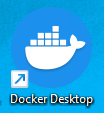

# COMANDOS DE MySQL

Parte de videoclases a las que asisti, patrocinadas por sence Chile.

**🚧 work in process**

## OBJETIVO

Compartir con quienes necesiten esta informacion en su camino de aprendizaje. Son varios comandos utiles y comunes que con los ejercicios
solicitados y las capturas de pantalla permite un facil entendimiento

## CONTENIDO

- COMANDOS
  - JOIN [LINK](https://github.com/noscriptph/PracticasMySQLComandosYWallet/blob/c9fb913b6bfc8008f6ed9d8696ed14278f0b0f85/JOIN%20UNIONES%20ENTRE%20TABLAS.md)
  - SELECT FROM AS DISTINTC LIMIT [LINK](https://github.com/noscriptph/PracticasMySQLComandosYWallet/blob/c9fb913b6bfc8008f6ed9d8696ed14278f0b0f85/SELECT-FROM-AS-DISTINTC-LIMIT.md)
  - WHERE BINARY [LINK](https://github.com/noscriptph/PracticasMySQLComandosYWallet/blob/c9fb913b6bfc8008f6ed9d8696ed14278f0b0f85/WHERE%2C%20BINARY.md)
  - ACADEMIA [LINK](Academia/ACADEMIA.md)
  - DISEÑANDO UNA BASE DE DATOS PARA UNA APLICACION DE GESTION DE BIBLIOTECAS [LINK](BASE%20DE%20DATOS%20BIBLIOTECA/BIBLIOTECA%20MYSQL.md)
  
## PROYECTO DE MODULO

- ALKEWALLET 2 [LINK](alkewallet2/REAME.md)

Segun la descripcion en el archivo entregado en el curso

>Situación inicial 📍

> Como parte de un equipo de programadores recibiste el pedido de Alke
Wallet de desarrollar el diseño de una base de datos relacional para
gestionar un sistema de una Wallet la cual permitirá a sus usuarios
almacenar y gestionar sus fondos, realizar transacciones y ver el
historial de transacciones. Nuestro líder técnico ya cuenta con los
requerimientos desagregados en un backlog de tareas listo para que
comencemos la etapa de desarrollo.

>Nuestro objetivo 📋

>El objetivo de esta evaluación es diseñar el modelo conceptual, definir las
relaciones entre las entidades de una wallet y crear la base de datos para
almacenar la información que sea necesaria.

Para ver mas pueden ingresar a siguiente [link](https://github.com/noscriptph/PracticasMySQLComandosYWallet/tree/7e7d625c6c9abe4820d61a794f9095f027fa96f5/alkewallet2)

## BONUS

### DOCKER DESKTOP

En las clases de ayudantia se enseño respecto a los usos de docker y que
beneficios tiene en el momento de desarrollar para evitar problemas de
compatibilidad, siendo este ultimo punto el que me llamo la atencion y me motivo a aprender mas respecto a este tema.

En palabras simples y sin tecnisismos, usar DOCKER DESKTOP me permite correr un kernel minimo de linux y desde el ejecutar un servidor de MySQL, para que me sirve esto, para probar de forma aislada del sistema operativo nativo de mi computador donde programo y no arrastrar ajustes especiales que en la fase de implementacion del codigo serian detonantes de que no exista compatilidad.

Otro punto fuerte es que la implementacion de mi servicio de MySQL es mucho mas facil para quien lo requiera ya que seria tan simple como que yo realice una exportacion del codigo y otro desarrollador lo importe en su propio hardware sin realizar muchos ajustes especiales.

Lo ideal seria agregar un tutorial de como implementar docker desktop en un futuro para quien quiera probar
