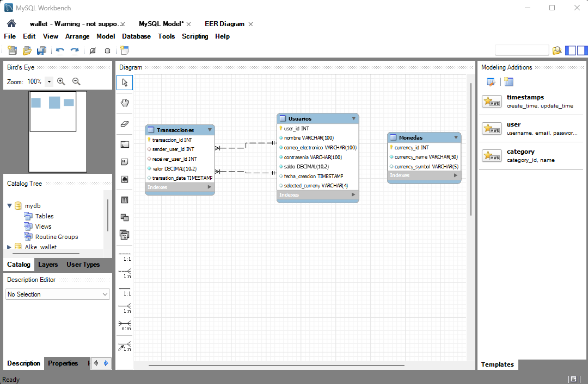
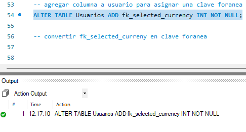
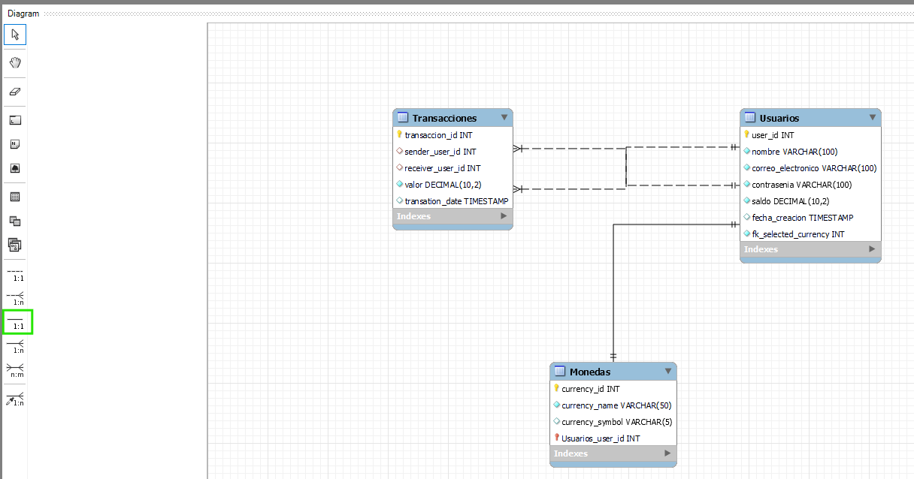

# CREAR CONSULTAS MySQL

En este apartado se desarrollara la consulta en la base de datos, todos los comandos seran indicados tomando en cuenta que esta base de datos esta seleccionada previamente, recuerda que debes seleccionar el codigo y ejecutarlo con el boton del rayo.

## REALIZAR CONSULTAS

### Consulta para obtener el nombre de la moneda elegida por un usuario específico

Haciendo uso de la convinacion `Ctrl`+`r` podemos ingresar al wizard para ver el diagrama ER de nuestra base de datos

**USAR LLAVE FORANEA PARA ESTO**

El enunciado ya nos indica que deberiamos tener una relacion entre la entidad `Usuarios` y la entidad `Monedas`, mas especificamente nos falta una columna para asignar el id de la moneda y la columna `currency_id` en `Monedas`.

Actualmente segun el diagrama er no existe esta relacion, asi que debemos crearla

Le pondremos el nombre `selected_currency` y la crearemos en la linea 54.

`ALTER TABLE Usuarios ADD fk_selected_currency INT NOT NULL;`

> [!NOTE]  
Usar datos tipo INT para claves foraneas

`foreign key(selected_curreny) references Monedas(currency_id),`

En caso de equivocarte al crear la nueva columna, usa el siguiente comando para borrarla

`ALTER TABLE tabla DROP COLUMN columna;`

despues debemos crear una relacion entre fk_selected_curreny y currency_id, para esto use la ayuda del diagrama ER y con la herramienta 1 a 1 seleccione la relaciones, despues hice una actualizacion del modelo para que se aplique

Finalmente debo popular la entidad `Usuarios` en la columna `fk_selected_currency` y agregar a que id de moneda corresponde, para esto voy a generar aleatoriamente estos numeros, tomando en cuenta que en total tengo asignadas 5 monedas en la entidad `Monedas`.

`
procedo a generar las relaciones con
Voy a consultar por el usuario 20, el se encuentra en la entidad usuarios

[volver](Desarrollo.md)