# CREAR CONSULTAS MySQL

En este apartado se desarrollara la consulta en la base de datos, todos los comandos seran indicados tomando en cuenta que esta base de datos esta seleccionada previamente, recuerda que debes seleccionar el codigo y ejecutarlo con el boton del rayo.

## REALIZAR CONSULTAS

### Consulta para obtener el nombre de la moneda elegida por un usuario específico

Haciendo uso de la convinacion `Ctrl`+`r` podemos ingresar al wizard para ver el diagrama ER de nuestra base de datos
primer desarrollo


desarrollo nuevo con tablas corregidas
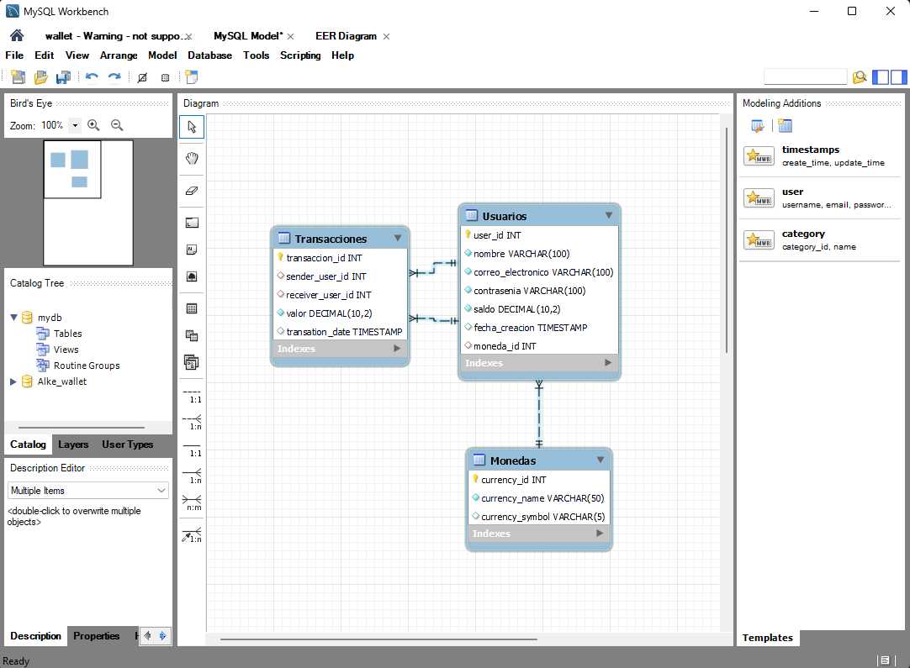

**USAR LLAVE FORANEA PARA ESTO**
(Esto ya esta corregido pero encuentro importante entregar el razonamiento que hubo detras de la correccion)

El enunciado ya nos indica que deberiamos tener una relacion entre la entidad `Usuarios` y la entidad `Monedas`, mas especificamente nos falta una columna para asignar el id de la moneda y la columna `currency_id` en `Monedas`.

Actualmente segun el diagrama er no existe esta relacion, asi que debemos crearla

Le pondremos el nombre `selected_currency` y la crearemos en la linea 54.

`ALTER TABLE Usuarios ADD fk_selected_currency INT NOT NULL;`


> [!NOTE]  
Usar datos tipo INT para claves foraneas

`foreign key(selected_curreny) references Monedas(currency_id),`

En caso de equivocarte al crear la nueva columna, usa el siguiente comando para borrarla

`ALTER TABLE tabla DROP COLUMN columna;`

despues debemos crear una relacion entre fk_selected_curreny y currency_id, para esto use la ayuda del diagrama ER y con la herramienta 1 a 1 seleccione la relaciones, despues hice una actualizacion del modelo para que se aplique


Finalmente debo popular la entidad `Usuarios` en la columna `fk_selected_currency` y agregar a que id de moneda corresponde, para esto voy a generar aleatoriamente estos numeros, tomando en cuenta que en total tengo asignadas 5 monedas en la entidad `Monedas`.

Procedo a generar las relaciones con

>[!NOTE]IMPORTANTE 
>Desde este punto usare la base de datos corregida para realizar todas las consultas que requiere el proyecto de wallet2.
>Ademas, todas las consultas estaran ordenadas en el archivo [wallet2consultas.sql](wallet2consultas.sql)

`Consulta para obtener el nombre de la moneda elegida por un
usuario específico`

con el siguiente comando consultare por el usuario 3(pueden cambiar el numero por otro para otros usuarios)

```MySQL
SELECT u.nombre AS nombre_usuario, m.currency_name AS nombre_moneda
FROM Usuarios u
JOIN Monedas m ON u.moneda_id = m.currency_id
WHERE u.user_id = 3;
```

esta es la respuesta de workbench

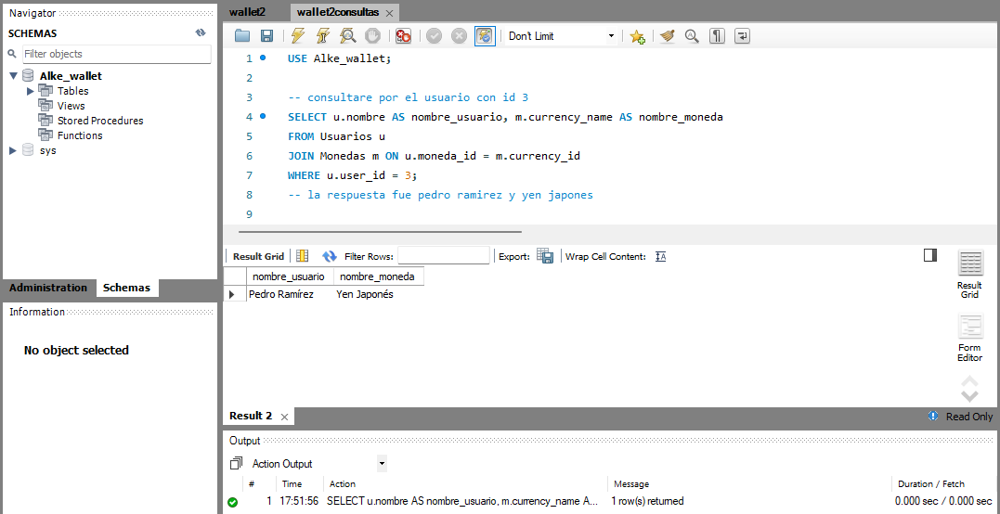

`-- Consulta para obtener las transacciones realizadas por un usuario específico`

usare este comando para consultar nuevamente por el usuario 3

```MySQL
SELECT * FROM Transacciones WHERE sender_user_id = 3;
```

workbench entrego el siguiente resultado
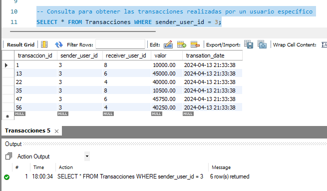

`Consulta para obtener todos los usuarios registrados`

este comando serviria para ver solo los nombres de los usuarios que estan en la entidad Usuarios, en este caso fui un poco mas alla e hice que no se repitan

```MySQL
SELECT DISTINCT nombre FROM Usuarios;
```

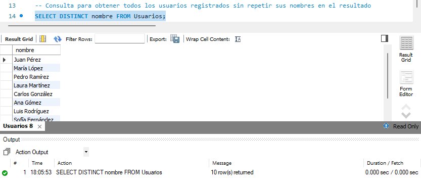

`Consulta para obtener todas las monedas registradas`
```MySQL
SELECT DISTINCT currency_name FROM Monedas;
```

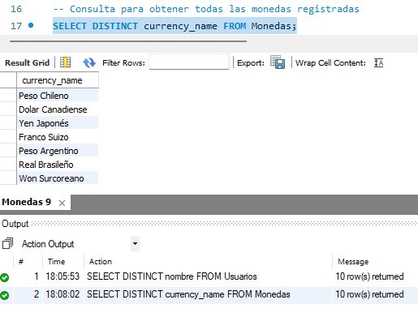

`Consulta para obtener todas las transacciones registradas`

```MySQL
SELECT * FROM Transacciones;
```

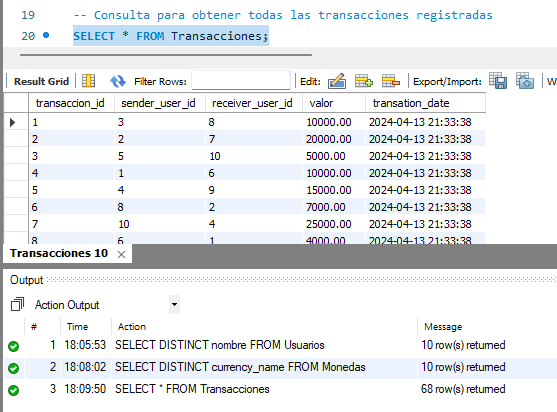

`Consulta para obtener todas las transacciones realizadas por un
usuario específico`

Este punto lo pide dos veces la guia, iba a hacerlo de tal forma de ver quienes le transfieren a un usuario especifico pero el siguiente paso era exactamente ese

`-- Consulta para obtener las transacciones realizadas hacia un usuario específico`

```MySQL
SELECT * FROM Transacciones WHERE receiver_user_id = 3;
```

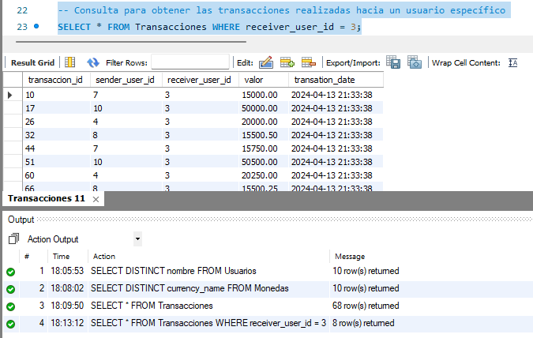

`Sentencia DML para modificar el campo correo electrónico de un
usuario específico
`

```MySQL
UPDATE Usuarios
SET correo_electronico = 'nuevo_correo@nuevo.com'
WHERE user_id = 3;
```

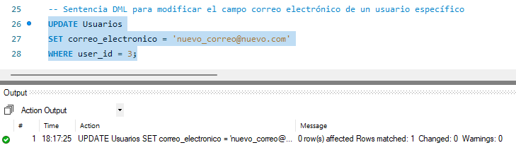

`Sentencia para eliminar los datos de una transacción (eliminado de
la fila completa)`

```MySQL
DELETE FROM Transacciones WHERE transaccion_id = 3;
```

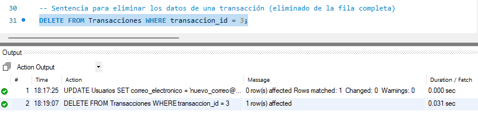

`Sentencia para DDL modificar el nombre de la columna
correo_electronico por email`

```MySQL
ALTER TABLE Usuarios CHANGE COLUMN correo_electronico email varchar(100) NOT NULL;
```

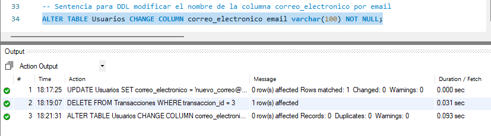

## Cuestiones a tener en cuenta al diseñar la base de datos:

>1. ¿Qué tipo de relación existe entre las entidades Usuario y
Transacción?

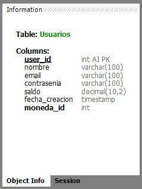
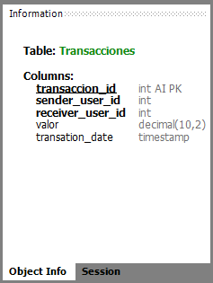

en la entidad Transacciones tenemos acceso a la informacion de usuario con las columnas sender_user_id y receiver_user_id lo que nos permite ahorra espacio anotando una sola vez toda la informacion persona en otra entidad que es Usuarios

>2. ¿Cómo podemos asegurarnos de que cada transacción está asociada
al usuario emisor y receptor correctos?

una forma de confirmar esto es revisando si los usuarios se han enviado dinero a ellos mismos, debemos tomar en cuenta que solo tienen una cuenta hasta el momento en la base de datos y esto no deberia pasar, podriamos usar el siguiente comando para verificar

```MySQL
SELECT * FROM Transacciones WHERE sender_user_id != receiver_user_id;
```

y luego ejecutar este comando

```MySQL
SELECT * FROM Alke_wallet.Transacciones;
```
confirmar que la cantidad de transacciones sean iguales, si no es asi, alguna transaccion esta equivocada.

una recomendacion seria crear una regla en la base de datos que bloquee el envio de dinero a uno mismos

```MySQL
DELIMITER //

CREATE TRIGGER evitar_transferencia_propia
BEFORE INSERT ON Transacciones
FOR EACH ROW
BEGIN
    IF NEW.sender_user_id = NEW.receiver_user_id THEN
        SIGNAL SQLSTATE '45000' SET MESSAGE_TEXT = 'No se puede transferir dinero a uno mismo';
    END IF;
END //

DELIMITER ;
```

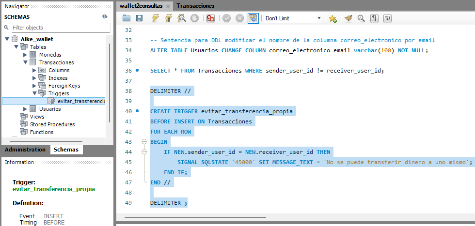

>3. ¿Cómo manejaremos la relación entre la entidad Transacción y la
entidad Moneda?

Este fue un punto que me hizo rehacer mi base de datos, para que la entidad Monedas y la entidad Transacciones esten vinculadas con el codigo id de la moneda usada en cada transaccion realizada, por lo cual para crear esta columna debo ejecutar el siguiente comando

```MySQL
ALTER TABLE Transacciones
ADD COLUMN currency_id INT NOT NULL,
ADD CONSTRAINT fk_transacciones_moneda
    FOREIGN KEY (currency_id) REFERENCES Monedas(currency_id);
```


>4. ¿Cuál debería ser la clave primaria de cada entidad para garantizar la
unicidad?


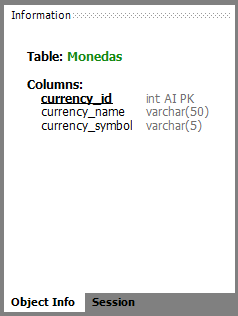

si las entidades fuesen historias, deberias identificar a su personaje principal, con el cual si falta estas pierden su proposito, en el caso de Usuarios es user_id, para Transacciones es transaccion_id y por ultimo para Monedas es currency_id


>5. ¿Qué restricciones debemos aplicar para mantener la integridad de
los datos?

separare esto en dos listas, una para restricciones en la aplicacion que accedera a la base de datos y otra para la base de datos misma

aplicacion que accede a la base de datos

-solo el usuario que inicie sesion podra realizar transferencia a su propio nombre

-el usuario que inicie sesion tendra acceso solo a la informacion que le permitan sus crendenciales

-evitaremos sobrecargar con peticiones desde la aplicacion para que no se produzca una denegacion de servicio

-los datos que se envien a la base de datos deben ser los correspondientes a los campos donde seran escritos


base de datos
-crear reglas para definir un monto minimo

-crear regla para evitar enviar numeros negativos en caso que se pueda

-los datos importantes(en este caso todos) deberan ser NOT NULL

-cuando se cargue informacion en la base de datos deberan rellenarse la fila completa de informacion para evitar informacion faltante que podria provocar errores de lectura

-los usuarios que accedan a la base de dats deberan tener niveles de acceso, como permisos de escritura, lectura, modificacion de datos en las entidades, modificacion de nombre de columnas, modificacion de caracteristicas de columnas, crear reglas, etc.

-en un futuro puede que sea necesario crear una columna en cada entidad que indique quien gatillo el ultimo cambio y en que campo fue

[volver](Desarrollo.md)