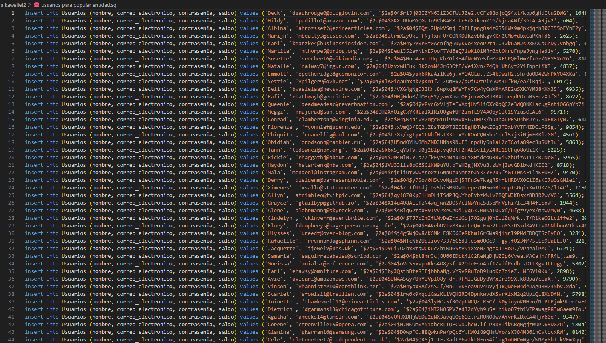

# DESARROLLO

## APLICACIONES

Empezamos descargando e instalando MySQL y MySQL Workbench


> [!NOTE]
> En este caso usare **Docker desktop** para realizar todos los comandos, mientras se ejecuta una imagen de MySQL en debian
#
> [!TIP]
> CADA VEZ QUE SE QUIERA ESCRIBIR UN COMENTARIO EN EL SCRIPT DE MySQL USAREMOS UN
> DOBLE GUION Y UN ESPACIO ANTES DEL TEXTO A COMENTARIO
> EJ:
> `-- comentario`

Workbench sera utilizado para acceder a nuestra base de datos alojada en docker o en MySQL

 

> [!IMPORTANT]
> Es importante indicar que en caso que utilices MySQL y docker ejecutando una imagen de MySQL sucedera un conflicto en el uso de puertos, se recomienda configurar uno de estos dos con otro puerto. En vez de usar 3306 podrias usar 3307

## CREAR LA BASE DE DATOS Y LAS TABLAS

Una vez instaladas, configuradas y ejecutadas las aplicaciones, lo que usaremos seria la insterfaz grafica de MySQL Workbench:


En la interfaz veremos la base de datos local al instalar MySQL8.3 client "local instance" y la base de datos ubicada en Docker "WALLET", para este ejercicio usare la base de datos WALLET

> [!TIP]
> Antes de carga Wallet que esta en el docker, se debe iniciar Docker desktop y dentro de el iniciar el contenedor con el simbolo encerrado en el cuadrado verde
> 

### WORKBENCH CONECTADO A LA BASE DE DATOS


Como podemos ver, solo existe la base de datos `sys` y el primer paso seria crear la base de datos Wallet2(el primer proyecto wallet fue creado en java e INTELLIJ IDEA)

### CREANDO BASE DE DATOS Wallet2

Todos los comandos seran guardados en el archivo: `Wallet2.sql` guardado en este mismo [repositorio](https://github.com/noscriptph/PracticasMySQLComandosYWallet/tree/7e3a80139b0901cda2296f8970c236ca65a4cdad/alkewallet2)

```MySQL
CREATE DATABASE IF NOT EXISTS Alke_wallet;
USE Alke_wallet;
```


Usar:

```MySQL
CREATE DATABASE IF NOT EXISTS Alke_wallet;
```

permite que se cree la base de datos independientemente de si existe o no una base de datos con este nombre `Alke_wallet`, es importante saber que algunos administradores como Workbench tienen medidas internas para evitar que se sobreescriban y se debe baipasear con algun comando o configuracion.

### CREANDO TABLAS SOLICITADAS

Ver desde la linea 6 en `Wallet2.sql`

Extracto de REQUERIMIENTOS:
>Crear Entidades:
>
>1 Usuario: Representa a cada usuario individual del sistema de monedero virtual.
>-Atributos:
>
>user_id (clave primaria)
>
>nombre
>
>correo electrónico
>
>contraseña
>
>saldo.
>
>2 Transacción: Representa cada transacción financiera realizada por los usuarios.
>
>-Atributos:
>
>transaction_id (Primary Key)
>
>sender_user_id (Foreign Key referenciando a User)
>
>receiver_user_id (Foreign Key referenciando a User) importe transaction_date.
>
>3- Moneda: Representa las diferentes monedas que se pueden utilizar en el monedero virtual.
>
>-Atributos:
>
>currency_id (Primary Key)
>
>currency_name
>
>currency_symbol

procedemos creando la tabla(desde ahora llamada entidad) **Usuarios**

```MySQL
CREATE TABLE IF NOT EXISTS Usuarios(
 user_id int auto_increment primary key,
 nombre varchar(100)NOT NULL,
 correo_electronico varchar(100) NOT NULL,
    contrasenia varchar(100) NOT NULL,
    saldo decimal(10,2)NOT NULL,
    -- indica que la fecha es actual al momento de realizarse de forma predeterminada
    fecha_creacion timestamp default current_timestamp
 );
```


Luego creamos la entidad **Transacciones**

Desde linea 17 en `Wallet2.sql`

```MySQL
CREATE TABLE IF NOT EXISTS Transacciones(
 transaccion_id int auto_increment primary key,
    sender_user_id int,
    receiver_user_id int,
    valor decimal(10,2)NOT NULL,
    transation_date timestamp default current_timestamp,
    foreign key(sender_user_id) references Usuarios(user_id),
    foreign key(receiver_user_id) references Usuarios(user_id)
    );
```


Por ultimo creamos la entidad **Monedas**

Desde linea 27 en `Wallet2.sql`

```MySQL
CREATE TABLE IF NOT EXISTS Monedas(
currency_id int auto_increment primary key,
currency_name varchar(50) NOT NULL,
currency_symbol varchar(5) 
);
```


> [!TIP]
> para ir ejecutando estos comando debes seleccionar el texto
> y luego darle al boton con forma de rayo 

# POPULANDO LAS TABLAS

> [!TIP]
> Puedes usar la web mockaroo para popular la tabla Usuarios con valores aleatorios,
> en mi caso rellene asi la web
>
> 
> esta es la informacion que extraje
>
> 
>
> despues solo la pegue en Workbench y ejecute todo, previamente tener seleccionada la base de datos

## ENTIDAD Usuarios


para ver la tabla solo debes ejecutar el comando:

(ver desde linea 33 en `Wallet2.sql`)

`SELECT * FROM Alke_wallet.Usuarios;`

## ENTIDAD Transacciones

Asi configure mockaroo para que genere 1000 Transacciones


luego tome todos los datos y popule la entidad


con el siguiente comando reviso si se aplicaron estos cambios

`select * from transacciones;`

si te da problemas seleccionar la entidad, debes usar este otro comando

(ver linea 40 en `Wallet2.sql`)
`SELECT * FROM Alke_wallet.Transacciones;`


Pensemos en el campo valor como el monto que se transfirio, en este caso casi todos tienen decimales, los cuales dejare ya que en un banco es normal estos se basen en porcentajes o bien intereses o reajustes, se entiende que normalmente no se transfieren cantidades diferentes a multiplos de algun digito de mayor relevancia, en este caso podria ser todo multiplo de 100 o de 1000, pero para tener una entidad con valores mas aleatorios lo dejare tal cual.

## ENTIDAD Monedas

Para esta tabla decidi popular algunas monedas pero de forma manual, para tener mayor control y que no se generen campos no relacionados, mockaroo hasta el momento no logra generar simbolos de moneda en una celda y en la siguiente el nombre asociado correspondiente.

Usare el siguiente comando

```MySQL
INSERT INTO Monedas (currency_name, currency_symbol)
VALUES
	("Dolar","$"),
    ("Euro", "Є"),
    ("Libra Esterlina", "£"),
    ("Peso Chileno","$"),
    ("Dolar Canadiense","Є");
```


Podemos confirmar los cambios ejecutando el comando de la **linea 51**

El siguiente apartado de la tarea sera desarrollado en otro documento

```python
Crear consultas SQL para:
```

puedes acceder al desarrollo de estos ejercicios por este [link](CrearConsultas.md)

> [!IMPORTANT]
> En la siguiente etapa se hiceron cambios sutiles y se reescribio la populacion de las tablas al detectar necesidades nuevas que la actual base de datos no satisfacia, a continuacion el link del archivo wallet2 y una imagen de como quedo el diagrama


[Alkewallet2 sql](wallet2.sql)


[Volver](REAME.md)

# <!-- markdownlint-disable-line -->

<div align='right'><!-- markdownlint-disable-line -->
built with 🍺 by noscriptph
</div>
