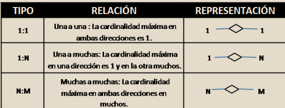

# Evaluación del módulo 3
## ALKEWALLET 2
### Proyecto Alke Wallet
Ejercicio: Creación de una base de datos relacional para una wallet virtual.

## Requerimientos 🤝
La Alke Wallet deberá cumplir con una serie de características y
requerimientos técnicos para garantizar la calidad y funcionalidad de la
misma.

Primero, como requerimiento general tenemos que poder implementar
todas las funcionalidades básicas que un usuario necesita para gestionar
sus fondos, realizar transacciones y ver el historial de transacciones,
las cuales son:

● Diseñar una Bases de Datos que garantice la coherencia y la
integridad de los datos

● Crear una conexión a una Bases de Datos llamada Alke Wallet

● Crear Entidades:

1. Usuario: Representa a cada usuario individual del sistema de
monedero virtual.
    - Atributos:

      - user_id (clave primaria)
      - nombre
      - correo electrónico
      - contraseña
      - saldo

2. Transacción: Representa cada transacción financiera realizada por los
usuarios.
    - Atributos:
      - transaction_id (Primary Key)
      - sender_user_id (Foreign Key referenciando a User)
      - receiver_user_id (Foreign Key referenciando a User)
      - importe
      - transaction_date.

3. Moneda: Representa las diferentes monedas que se pueden utilizar
en el monedero virtual.
    - Atributos:
      - currency_id (Primary Key)
      - currency_name
      - currency_symbol

● Crear consultas SQL para:

    - Consulta para obtener el nombre de la moneda elegida por un usuario específico

    - Consulta para obtener las transacciones realizadas por un usuario específico

    - Consulta para obtener todos los usuarios registrados

    - Consulta para obtener todas las monedas registradas

    - Consulta para obtener todas las transacciones registradas

    - Consulta para obtener todas las transacciones realizadas por un usuario específico

    - Consulta para obtener todas las transacciones recibidas por un usuario específico

    - Sentencia DML para modificar el campo correo electrónico de un usuario específico

    - Sentencia para eliminar los datos de una transacción (eliminado de la fila completa)

    - Sentencia para DDL modificar el nombre de la columna correo_electronico por email

## Tu tarea es diseñar el modelo conceptual y definir las relaciones entre estas entidades considerando lo siguiente:

1. Un usuario puede tener múltiples transacciones, tanto como emisor
como receptor.

2. Cada transacción implica un importe específico y está asociada a una
fecha de transacción.

3. El monedero virtual admite múltiples divisas, y cada transacción debe
estar asociada a una divisa concreta.

● Generar consultas SQL para: obtener todos los usuarios,

## Cuestiones a tener en cuenta al diseñar la base de datos:

1. ¿Qué tipo de relación existe entre las entidades Usuario y
Transacción?

2. ¿Cómo podemos asegurarnos de que cada transacción está asociada
al usuario emisor y receptor correctos?

3. ¿Cómo manejaremos la relación entre la entidad Transacción y la
entidad Moneda?

4. ¿Cuál debería ser la clave primaria de cada entidad para garantizar la
unicidad?

5. ¿Qué restricciones debemos aplicar para mantener la integridad de
los datos?

Después de diseñar el modelo conceptual y definir las relaciones, puede
proceder a implementar la base de datos del monedero virtual utilizando
SQL. Puede crear las tablas necesarias, configurar las claves primarias y las
claves externas, y añadir restricciones para mantener la integridad de los
datos.

**Requerimientos técnicos:**
● Utilizar MySQL como Sistema de Gestión de Bases de Datos Relacionales (RDBMS)

● Implementar sentencias SQL para crear la tablas y sus entidades

● Implementar la Integridad referencial utilizando claves primarias y claves externas

● Implementar el principio ACID

● Utilizar DDL para la definición de Tablas

● Utilizar DML para recuperar, modificar, insertar y borrar datos dentro de una base de datos.

● Implementar el modelo Entidad-Relación

## ¿Qué vamos a validar?🔍

Con el objetivo de brindar transparencia sobre lo que se espera construir, este
ítem responderá a la pregunta ¿Qué vamos a evaluar del producto? y ¿cuáles
son los criterios de evaluación?, por lo que será necesario detallar 3 aspectos
claves:

● Aspectos técnicos: Diseño de la base de datos, Integridad de los datos,
utilización de identificadores de bases de datos, integridad referencial,
utilización de SQL, DDL y DML para la manipulación de datos.

● Aspectos estructurales: cumplimiento del principio ACID, es decir, que la
base de datos debe ser atómica, consistente, asilada y durable Es de suma
importancia que el diseño de la base de datos y la relación entre sus tablas
garantice la coherencia y la integridad de los datos.

Para asegurar el correcto cumplimiento de las tareas, el líder se encargará
de revisar diferentes aristas del proyecto. Estos son algunos puntos que
vamos a validar:

● Manejo de la RDBMS - MySQL

● Manejo de la interfaz gráfica MySQL Workbench

● Diseño de la bases de datos.

● Manejo de SQL

● Cumplimiento de los requisitos

## Recursos🎁
Tener en cuenta los tipos de relación:

## Entregables ✅

● Repositorio en GitHub que contenga todas las consultas SQL que fueron utilizadas para crear la base de datos de la Vitual Wallet.

● El archivo deberá tener la extensión .sql

● El nombre del repositorio deberá ser Módulo 3 - Fundamentos de Bases de Datos Relacionales

## Desarrolo 

Puede acceder con el siguiente [link](Desarrollo.md)